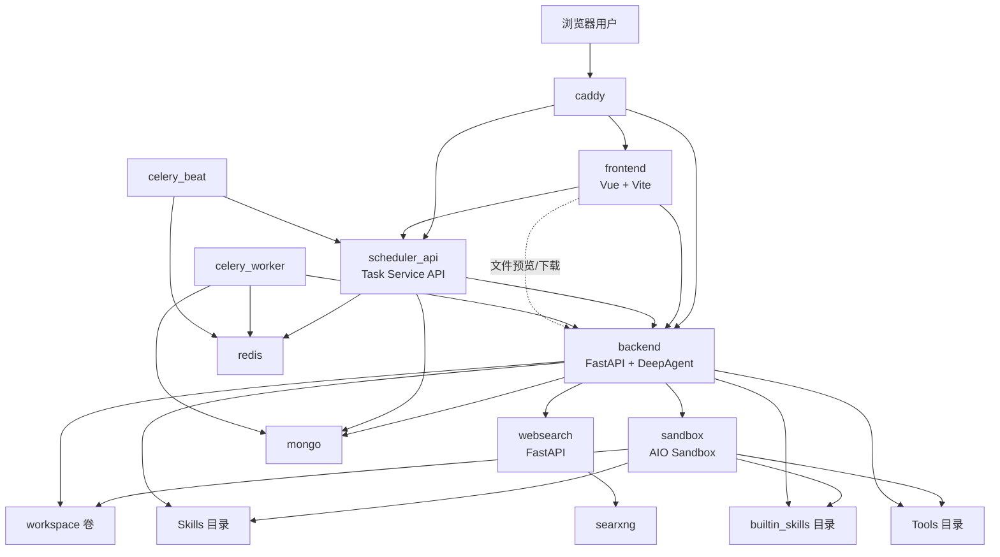
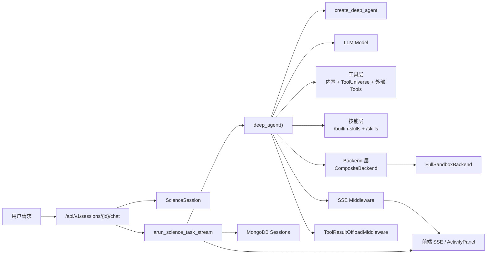
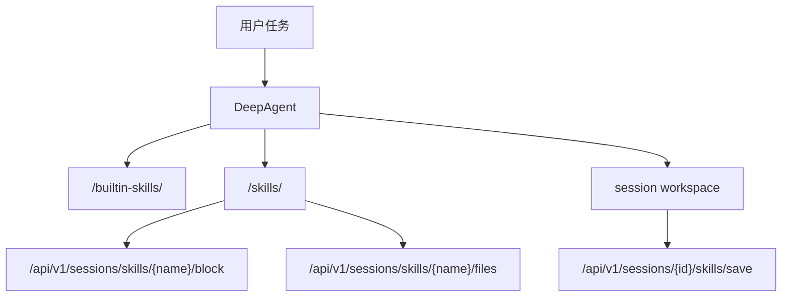
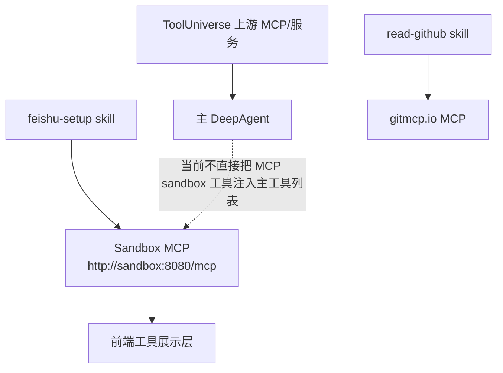
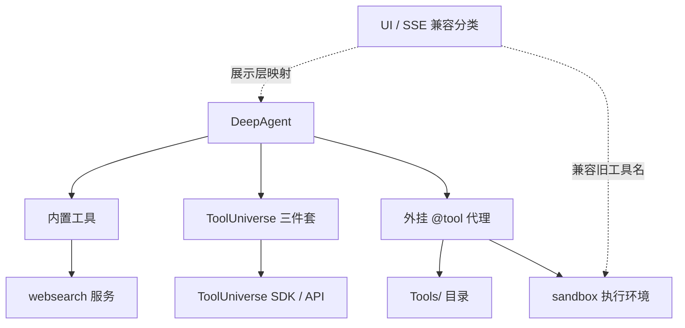
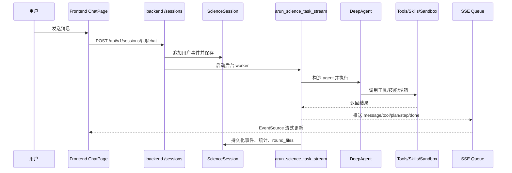
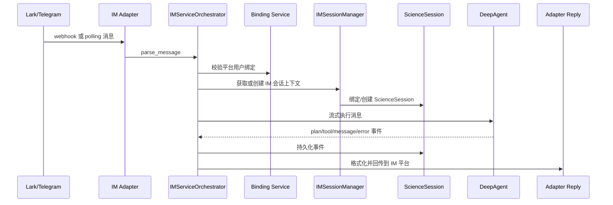
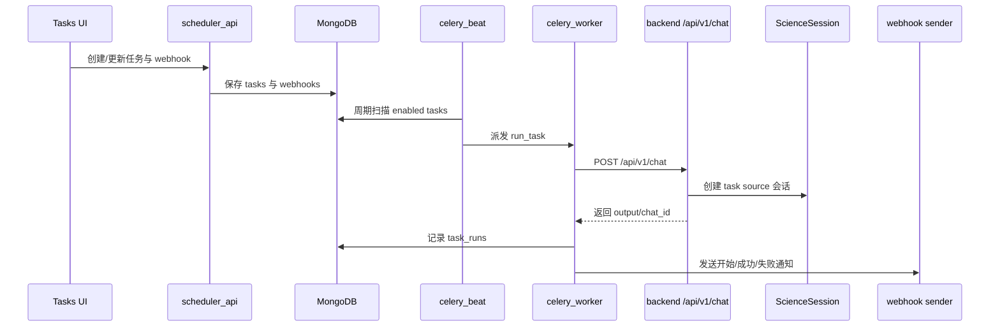
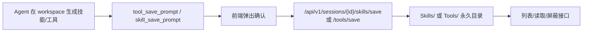

# ScienceClaw 全量技术文档报告

## 0. 报告说明

本报告基于当前仓库代码、配置文件与目录结构编写，目标不是复述 README，而是给出一份面向开发者、维护者和二次集成者的技术说明，回答以下问题：

- ScienceClaw 由哪些服务组成，分别负责什么
- 主 Agent 的真实运行时分层是什么
- 仓库里有哪些 agent、skills、MCP、tools，它们各自做什么
- Web Chat、IM 接入、定时任务、技能/工具保存等关键工作流如何闭环
- 前端页面、后端 API、SSE 事件和工具展示层是如何对应的

本报告中的“代码依据”均来自当前工作区代码现状，包含当前未提交改动反映出的实现状态。

代码依据：

- `docker-compose.yml`
- `ScienceClaw/backend/main.py`
- `ScienceClaw/backend/deepagent/agent.py`
- `ScienceClaw/backend/deepagent/runner.py`
- `ScienceClaw/backend/deepagent/full_sandbox_backend.py`
- `ScienceClaw/backend/deepagent/sse_protocol.py`
- `ScienceClaw/backend/route/sessions.py`
- `ScienceClaw/backend/route/im.py`
- `ScienceClaw/backend/im/orchestrator.py`
- `ScienceClaw/backend/deepagent/tools.py`
- `ScienceClaw/backend/deepagent/tooluniverse_tools.py`
- `Tools/__init__.py`
- `ScienceClaw/task-service/app/tasks.py`
- `ScienceClaw/frontend/src/main.ts`
- `ScienceClaw/frontend/src/constants/tool.ts`

## 1. 项目总览与仓库结构

ScienceClaw 是一个以 Docker 编排为基础的多服务科研助手系统。它并不是“一个前端 + 一个后端”的简单应用，而是由以下几层共同组成：

- 交互层：Vue 3 前端、聊天页、技能页、工具页、任务页、分享页
- 编排层：FastAPI 后端，负责会话、Agent、模型、文件、IM、ToolUniverse、统计等
- Agent 运行时：基于 `deepagents` 的 `DeepAgent` 组装层
- 执行层：AIO Sandbox 容器，提供隔离执行、文件系统、浏览器与终端环境
- 搜索层：`websearch` 服务，内部再依赖 SearXNG 与 Crawl4AI
- 调度层：`task-service` + Celery Worker + Celery Beat
- 数据层：MongoDB、Redis、工作区卷 `workspace/`
- 扩展层：内置 skills、外挂 `Skills/`、外挂 `Tools/`

仓库主目录职责如下：

| 路径 | 作用 |
| --- | --- |
| `ScienceClaw/backend/` | 主后端，负责 Agent、会话、文件、模型、IM、ToolUniverse、SSE |
| `ScienceClaw/frontend/` | Web 前端，负责聊天、工具/技能管理、任务与分享页面 |
| `ScienceClaw/task-service/` | 定时任务 API、Celery Worker/Beat |
| `ScienceClaw/websearch/` | 搜索与网页爬取服务 |
| `ScienceClaw/sandbox/` | 沙箱镜像与工具执行入口 |
| `ScienceClaw/backend/builtin_skills/` | 后端内置技能包 |
| `Skills/` | 仓库外挂技能目录 |
| `Tools/` | 仓库外挂工具目录 |
| `workspace/` | 共享工作区，Agent 产物与会话文件落盘位置 |

需要特别注意的是：`Tools/` 当前只有一个 `__init__.py` 加载器，没有实际自定义 `@tool` 文件，因此“外挂工具机制已经存在”，但“当前仓库快照里没有用户自定义工具样例”。

代码依据：

- `ScienceClaw/frontend/src/main.ts`
- `Tools/__init__.py`
- `ScienceClaw/backend/deepagent/sessions.py`

## 2. 部署与服务拓扑

### 2.1 Compose 服务拓扑

图中展示的是当前 `docker-compose.yml` 的真实部署关系：

- `backend` 是主业务入口，端口映射为 `12001:8000`
- `scheduler_api` 是定时任务服务入口，端口映射为 `12002:8001`
- `frontend` 开发态通过 Vite 暴露 `5173`
- `caddy` 统一反向代理前端、后端、任务服务
- `sandbox` 对外映射 `18080:8080`
- `websearch` 对外映射 `8068:8068`
- `searxng` 对外映射 `26080:8080`
- `mongo` 对外映射 `27014:27017`
- `redis` 仅供容器内部使用

### 2.2 服务职责

| 服务 | 主要职责 | 关键依赖 |
| --- | --- | --- |
| `frontend` | 聊天 UI、技能/工具管理、任务与分享页面 | `backend`、`scheduler_api` |
| `backend` | 会话管理、Agent 执行、SSE 推流、文件访问、IM、模型管理 | `sandbox`、`mongo`、`websearch` |
| `sandbox` | 隔离执行环境、共享工作区、浏览器/终端/文件能力 | `workspace`、`Skills`、`Tools` |
| `websearch` | 对外提供 `web_search` 与 `crawl_urls` API | `searxng`、Playwright/Crawl4AI |
| `scheduler_api` | 定时任务 CRUD、Webhook CRUD、自然语言转 crontab | `mongo`、`redis`、`backend` |
| `celery_worker` | 真正执行定时任务，调用后端 `/api/v1/chat` | `redis`、`mongo`、`backend` |
| `celery_beat` | 周期扫描并派发 due task | `redis`、`scheduler_api` |
| `mongo` | 会话、模型、IM 绑定、任务、webhook 等持久化 | 无 |
| `redis` | Celery broker / beat 协调 | 无 |

### 2.3 当前部署特征

- `backend` 同时挂载 `Tools/` 和 `Skills/` 为可写目录，因此支持热更新、保存和删除外挂技能/工具。
- `sandbox` 将 `Skills/`、`builtin_skills/`、`Tools/` 只读挂载到容器中，保证执行环境能读取到技能和工具文件。
- `workspace/` 同时挂载到 `backend` 与 `sandbox`，形成“文件系统与执行环境共享”的工作区。
- `websearch` 启动时会自动安装 Playwright Chromium，并初始化爬虫实例。
- `backend` 启动时会连接 MongoDB、初始化系统模型、创建默认管理员、清理孤儿会话、启动 IM 运行时。

代码依据：

- `docker-compose.yml`
- `ScienceClaw/backend/main.py`
- `ScienceClaw/task-service/app/main.py`
- `ScienceClaw/websearch/main.py`

## 3. Agent 架构与运行时分层

### 3.1 主 Agent 运行时分层图

### 3.2 运行时真实分层

当前主 Agent 的核心入口是 `ScienceClaw/backend/deepagent/agent.py` 中的 `deep_agent()`。它做了以下事情：

1. 根据用户模型配置调用 `get_llm_model()` 构造 LLM。
2. 查询用户屏蔽的 skills 与 tools。
3. 创建 `FullSandboxBackend`，用于文件、执行和环境上下文访问。
4. 用 `CompositeBackend` 将 `/builtin-skills/` 与 `/skills/` 路由到不同后端。
5. 组合工具列表：
   - 内置工具
   - ToolUniverse 三件套
   - `Tools/` 目录扫描出的代理工具
6. 注入中间件：
   - `ToolResultOffloadMiddleware`
   - `SSEMonitoringMiddleware`
7. 注入 memory 文件：
   - 全局 `AGENTS.md`
   - 会话级 `CONTEXT.md`
8. 临时增强 `GENERAL_PURPOSE_SUBAGENT` 的系统提示词，再调用 `create_deep_agent()`

### 3.3 关键运行时组件

| 组件 | 作用 |
| --- | --- |
| `ScienceSession` | 会话对象，持有 `events`、`plan`、`workspace`、状态与标题 |
| `FullSandboxBackend` | 面向 AIO Sandbox REST API 的后端适配器 |
| `CompositeBackend` | 将技能路径映射到内置技能目录和外挂技能目录 |
| `SSEMonitoringMiddleware` | 拦截工具调用，生成前端消费的工具事件 |
| `ToolResultOffloadMiddleware` | 将大型工具结果落盘，降低上下文膨胀 |
| `DiagnosticLogger` | 诊断模式下记录完整上下文，便于质量分析 |
| `DirWatcher` | 监控 `Tools/`、`Skills/` 目录变化，按需重载 |

### 3.4 主 Agent、子 Agent 与 Eval Agent

当前代码里可以明确识别出三类 agent 角色：

| Agent | 定义位置 | 作用 |
| --- | --- | --- |
| 主 `DeepAgent` | `backend/deepagent/agent.py` | 常规用户请求执行主体 |
| 通用子 Agent | `deepagents.middleware.subagents.GENERAL_PURPOSE_SUBAGENT` | 由 DeepAgents 内部机制按需委派使用 |
| `EvalAgent` | `deep_agent_eval()` | 用于 skill 测试与评估场景 |

这里没有自定义多种业务子 agent 类，而是基于 DeepAgents 的通用子 agent 提示词增强机制完成委派。

### 3.5 模型层特征

模型工厂位于 `backend/deepagent/engine.py`，核心特点：

- 使用 `ChatOpenAI` 兼容 OpenAI 风格接口
- 对多家“思维链/推理内容”兼容性做了 monkey patch
- 内置一大张已知模型上下文窗口表
- 支持用户自定义模型配置，并可探测 context window

### 3.6 记忆与文件侧效果

每个 session 都会得到：

- `/home/scienceclaw/{session_id}/CONTEXT.md`
- `/home/scienceclaw/_memory/{user_id}/AGENTS.md`
- `/home/scienceclaw/{session_id}/planner.md`

这意味着 ScienceClaw 的“会话记忆”和“用户偏好记忆”不是只保存在数据库中，而是明确落盘为可读 Markdown 文件。

### 3.7 实现现状与注意事项

- README 强调 AIO Sandbox 提供 Browser/Shell/File/MCP 一体化能力，这在平台层面成立。
- 但主 Agent 当前实现已经明确写出“不再直接使用 MCP sandbox 工具作为主工具列表”，而是以：
  - 内置工具
  - ToolUniverse 工具
  - 外部 `Tools/` 代理工具
  - `FullSandboxBackend` 文件/执行能力
  为主。
- 因此前端中看到的大量 `mcp` / `browser_*` / `terminal_*` 名称，很多属于兼容展示层，而不等于主 Agent 每次都会直接注入这些工具。

代码依据：

- `ScienceClaw/backend/deepagent/agent.py`
- `ScienceClaw/backend/deepagent/runner.py`
- `ScienceClaw/backend/deepagent/full_sandbox_backend.py`
- `ScienceClaw/backend/deepagent/sessions.py`
- `ScienceClaw/backend/deepagent/engine.py`

## 4. Skills 体系

### 4.1 技能来源分层

ScienceClaw 的技能分为两类：

1. 后端内置技能
2. 仓库外挂技能

它们在运行时通过不同的路径注入：

- 内置技能：`/builtin-skills/`
- 外挂技能：`/skills/`

内置技能始终可读；外挂技能支持屏蔽、删除、查看文件与从 session 保存。

### 4.2 Skills 关系图

### 4.3 后端内置技能

| 技能 | 主要用途 | 典型输入/输出 | 关联服务/工具 |
| --- | --- | --- | --- |
| `docx` | 读写和编辑 Word 文档 | 输入 `.docx`，输出 Word 文件 | sandbox、office 脚本 |
| `feishu-setup` | 自动配置飞书/Lark 机器人 | 输入 app 名称，输出完成配置的机器人 | sandbox browser MCP、backend IM |
| `find-skills` | 搜索并安装技能生态中的 skill | 输入 query，输出候选 skill 或安装结果 | `skills` CLI |
| `pdf` | PDF 读取、OCR、合并、拆分、表单填写、报告生成 | 输入 PDF 或文本材料，输出 PDF | sandbox、report 脚本 |
| `pptx` | 创建或编辑演示文稿 | 输入内容/现有幻灯片，输出 `.pptx` | sandbox、office 脚本 |
| `skill-creator` | 设计、评估和改进技能 | 输入 skill 需求，输出 `SKILL.md` 草案与评估结果 | `eval_skill`、`grade_eval` |
| `tool-creator` | 创建或升级 `@tool` 工具 | 输入能力描述，输出 `tools_staging/*.py` | sandbox、`propose_tool_save` |
| `tooluniverse` | 引导使用 ToolUniverse 科研工具 | 输入科研任务，输出工具搜索/执行路径 | ToolUniverse 三件套 |
| `xlsx` | 处理表格与电子表格 | 输入 `.xlsx/.csv/.tsv`，输出表格文件 | sandbox、office 脚本 |

### 4.4 仓库外挂技能

| 技能 | 主要用途 | 典型输入/输出 | 关联服务/工具 |
| --- | --- | --- | --- |
| `brainstorming` | 在任何创造性实现前做需求和设计探索 | 输入想法，输出规格方向 | 规划型工作流 |
| `copywriting` | 营销文案、页面文案重写 | 输入页面草稿，输出转化导向文案 | 文案参考资料 |
| `deep-research` | 多源深度调研与专业报告生成 | 输入研究问题，输出研究材料与报告 | `web_search`、ToolUniverse、文献检索 |
| `read-github` | 通过 `gitmcp.io` 读取 GitHub 仓库文档与代码 | 输入仓库 URL，输出文档或搜索结果 | gitmcp.io MCP、`scripts/gitmcp.py` |
| `weather` | 实时天气与天气预报查询 | 输入城市/时段，输出天气信息 | 相关天气工具或外部数据源 |
| `writing-plans` | 多步骤任务的实现计划编写 | 输入需求/规格，输出计划文档 | 计划审阅工作流 |

### 4.5 技能管理接口

`backend/route/sessions.py` 暴露了技能管理接口：

- `GET /api/v1/sessions/skills`
- `PUT /api/v1/sessions/skills/{skill_name}/block`
- `DELETE /api/v1/sessions/skills/{skill_name}`
- `POST /api/v1/sessions/{session_id}/skills/save`
- `GET /api/v1/sessions/skills/{skill_name}/files`
- `POST /api/v1/sessions/skills/{skill_name}/read`

这意味着技能不是“只能手工拷贝目录”，而是前端已具备技能浏览、屏蔽、读取与保存的完整后端支持。

### 4.6 当前技能体系的设计特点

- 技能本质上是结构化指令文档，而不是工具代码。
- 技能注入走文件系统后端，而不是数据库注册表。
- 技能既可以是功能型技能，也可以是流程型、方法论型技能。
- `deep-research`、`tool-creator`、`skill-creator` 是典型的“元能力技能”。

代码依据：

- `ScienceClaw/backend/deepagent/agent.py`
- `ScienceClaw/backend/route/sessions.py`
- `ScienceClaw/backend/builtin_skills/*/SKILL.md`
- `Skills/*/SKILL.md`

## 5. MCP 体系

### 5.1 总体判断

ScienceClaw 仓库里确实存在 MCP 相关能力，但需要分层理解，不能简单地把所有 “MCP” 都当成“主 Agent 当前直接使用的工具”。

### 5.2 MCP 分层图

### 5.3 平台级 Sandbox MCP

在配置层，`backend/config.py` 明确定义了：

- `SANDBOX_MCP_URL=http://sandbox:8080/mcp`

前端 `constants/tool.ts` 和后端 `sse_protocol.py` 中也保留了大量 MCP Sandbox 工具名映射，例如：

- 终端类：`terminal_execute`、`terminal_session`、`terminal_kill`
- 文件类：`file_list`、`file_search`、`file_replace`
- 浏览器类：`browser_navigate`、`browser_click`、`browser_extract`、`browser_screenshot`
- 文档类：`markitdown_extract`、`markitdown_convert`
- 实际 sandbox 名称：`sandbox_execute_bash`、`sandbox_file_operations`、`sandbox_browser_execute_action`

这些名字的主要用途有两类：

1. 兼容/归一化旧事件与 UI 工具视图
2. 为某些技能或平台层能力保留 MCP 表达方式

### 5.4 技能级 MCP

#### `feishu-setup`

这是仓库里最明确的“直接使用 sandbox browser MCP”的技能：

- `SKILL.md` 明写“sandbox container must be running”
- `scripts/feishu_auto_setup.py` 直接向 `http://localhost:8080/mcp` 发 JSON-RPC 请求
- `feishu_full_setup.py` 是推荐的一站式执行入口

它说明：即使主 Agent 当前不把 MCP sandbox 工具作为主工具列表注入，某些技能仍然可以直接使用 MCP。

#### `read-github`

这是另一类技能级 MCP：

- 它不走本地 sandbox MCP
- 它通过 `gitmcp.io` 远端 MCP 服务访问 GitHub 仓库文档
- `scripts/gitmcp.py` 使用 `npx -y mcp-remote` 与远端 MCP 服务交互

### 5.5 ToolUniverse 相关上游 MCP/服务型环境变量

`backend/.env.template` 中出现了多类与 ToolUniverse 生态有关的环境变量，例如：

- `BOLTZ_MCP_SERVER_HOST`
- `ESM_MCP_SERVER_HOST`
- `TXAGENT_MCP_SERVER_HOST`
- `USPTO_MCP_SERVER_HOST`
- `EXPERT_FEEDBACK_MCP_SERVER_URL`

这些变量并不等于“ScienceClaw 主后端自己实现了这些 MCP 服务”，更准确的理解是：

- ScienceClaw 预留了 ToolUniverse 及其上游工具生态需要的环境配置入口
- 其中部分上游能力可能通过 MCP server host 的形式对接
- 它们主要服务于 ToolUniverse 或特定科研工具链，而不是前端直接访问

### 5.6 实现现状与注意事项

当前代码应这样理解：

- “平台有 MCP 能力”是成立的
- “部分技能直接用 MCP”是成立的
- “前端工具展示层保留了 MCP 分类”是成立的
- 但“主 DeepAgent 当前直接把一整套 MCP sandbox 工具注入主工具列表”并不成立

这是理解 ScienceClaw 技术架构时最容易混淆的点。

代码依据：

- `ScienceClaw/backend/config.py`
- `ScienceClaw/backend/deepagent/agent.py`
- `ScienceClaw/backend/deepagent/sse_protocol.py`
- `ScienceClaw/frontend/src/constants/tool.ts`
- `ScienceClaw/backend/builtin_skills/feishu-setup/SKILL.md`
- `ScienceClaw/backend/builtin_skills/feishu-setup/scripts/feishu_auto_setup.py`
- `Skills/read-github/SKILL.md`
- `Skills/read-github/scripts/gitmcp.py`

## 6. Tools 体系

### 6.1 工具来源分层

当前 ScienceClaw 的工具体系可以分成四层：

1. 主 Agent 内置工具
2. ToolUniverse 三件套
3. 外部自定义 `@tool`
4. UI/SSE 兼容分类工具名

### 6.2 工具关系图

### 6.3 主 Agent 内置工具

`backend/deepagent/agent.py` 中 `_STATIC_TOOLS` 明确列出了主 Agent 的内置工具：

| 工具 | 作用 |
| --- | --- |
| `web_search` | 调用 `websearch` 服务进行联网搜索 |
| `web_crawl` | 调用 `websearch` 服务抓取网页内容 |
| `propose_skill_save` | 生成技能保存确认提示 |
| `propose_tool_save` | 生成工具保存确认提示 |
| `eval_skill` | 运行 skill 评测 |
| `grade_eval` | 对评测结果做断言式评分 |

其中：

- `web_search`/`web_crawl` 不是直接抓互联网，而是通过后端调用 `websearch` 微服务
- `propose_*` 本身不执行保存，只负责触发前端确认
- `eval_skill`/`grade_eval` 主要服务于 `skill-creator`

### 6.4 ToolUniverse 三件套

`backend/deepagent/tooluniverse_tools.py` 暴露了统一的科研工具入口：

| 工具 | 作用 | 标准流程 |
| --- | --- | --- |
| `tooluniverse_search` | 搜索适用的科学工具名 | 第一步 |
| `tooluniverse_info` | 查看工具规格和参数模式 | 第二步 |
| `tooluniverse_run` | 真正执行工具并获取数据 | 第三步 |

设计上遵循固定三步法：

`tooluniverse_search -> tooluniverse_info -> tooluniverse_run`

对应的 REST 管理接口位于 `backend/route/tooluniverse.py`：

- `GET /api/v1/tooluniverse/tools`
- `GET /api/v1/tooluniverse/tools/{tool_name}`
- `POST /api/v1/tooluniverse/tools/{tool_name}/run`
- `GET /api/v1/tooluniverse/categories`

### 6.5 外部自定义工具

`Tools/__init__.py` 实现了外挂工具机制：

1. 用 AST 静态解析 `Tools/*.py`
2. 查找 `@tool` 修饰函数
3. 动态生成 LangChain `StructuredTool`
4. 调用时并不在 backend 进程直接 import，而是转发到 sandbox 中执行
5. sandbox 内通过 `/app/_tool_runner.py` 真实加载并运行函数

这种设计有两个明显好处：

- 测试环境等于生产环境
- 避免 backend 与 sandbox Python 包环境不一致

当前仓库快照中的现实情况：

- `Tools/` 目录只有 `__init__.py`
- 没有实际外挂工具文件
- 但保存、读取、删除、屏蔽外挂工具的后端能力已经完整存在

对应接口：

- `GET /api/v1/sessions/tools`
- `PUT /api/v1/sessions/tools/{tool_name}/block`
- `DELETE /api/v1/sessions/tools/{tool_name}`
- `POST /api/v1/sessions/tools/{tool_name}/read`
- `POST /api/v1/sessions/{session_id}/tools/save`

### 6.6 UI/SSE 兼容工具分类

前端 `frontend/src/constants/tool.ts` 保留了大量工具名到“视图类型/图标/展示文案”的映射，例如：

- `shell` / `execute` / `sandbox_exec` / `terminal_execute` -> 终端视图
- `file_*` / `read_file` / `write_file` / `edit_file` -> 文件视图
- `browser_*` -> 浏览器视图
- `mcp` -> MCP Tool 视图

这层的目标是“统一展示工具事件”，而不是“声明这些工具都在当前主 Agent 默认注入”。

### 6.7 实现现状与注意事项

- 当前运行时真实工具列表应以 `agent.py` 为准。
- 当前前端展示层工具名映射应以 `constants/tool.ts` 与 `sse_protocol.py` 为准。
- 两者并不完全等价，前者偏运行时，后者偏展示兼容层。

代码依据：

- `ScienceClaw/backend/deepagent/agent.py`
- `ScienceClaw/backend/deepagent/tools.py`
- `ScienceClaw/backend/deepagent/tooluniverse_tools.py`
- `ScienceClaw/backend/route/tooluniverse.py`
- `Tools/__init__.py`
- `ScienceClaw/backend/route/sessions.py`
- `ScienceClaw/frontend/src/constants/tool.ts`

## 7. 核心工作流

### 7.1 Web Chat 会话工作流

这个流程的关键点在于：

- 会话事件会先落 MongoDB，再通过 SSE 实时推给前端
- 后台 worker 会跟踪 `round_files`，用于前端文件面板和完成态显示
- 当有新 skill 或 tool 落到工作区时，会自动触发保存提示事件

### 7.2 IM 接入工作流

IM 层的几个重要设计点：

- 通过 `IMPlatform` 抽象平台类型
- `IMServiceOrchestrator` 统一处理消息去重、绑定校验、会话路由、进度推送
- `IMSessionManager` 会根据平台和 chat 类型决定会话归属
- Telegram 支持 polling 与 webhook 两种入口模式

### 7.3 定时任务工作流

这个链路意味着：

- 定时任务并不是“直接在 task-service 里跑 Agent”
- task-service 更像调度和通知中心
- 真正的 Agent 执行仍然统一走 backend `/api/v1/chat`
- 因此任务执行产生的对话，也会进入 ScienceClaw 的会话体系

### 7.4 技能/工具保存工作流

保存逻辑有两个特点：

- tool 先写入 `tools_staging/`，再复制到 `Tools/`
- skill 可能来自 `.agents/skills/`、`skills/` 或 session 根目录中的 skill 目录

代码依据：

- `ScienceClaw/backend/route/sessions.py`
- `ScienceClaw/backend/route/im.py`
- `ScienceClaw/backend/im/orchestrator.py`
- `ScienceClaw/task-service/app/tasks.py`

## 8. 前端页面、API、数据流映射与结论

### 8.1 前端路由入口

`frontend/src/main.ts` 定义了以下核心路由：

| 路由 | 页面 | 说明 |
| --- | --- | --- |
| `/chat` / `/` / `/home` | `HomePage` | 首页/空会话入口 |
| `/chat/:sessionId` | `ChatPage` | 会话聊天页 |
| `/chat/skills` | `SkillsPage` | 技能列表页 |
| `/chat/skills/:skillName` | `SkillDetailPage` | 技能详情页 |
| `/chat/tools` | `ToolsPage` | 工具列表页 |
| `/chat/tools/:toolName` | `ToolDetailPage` | 工具详情页 |
| `/chat/science-tools/:toolName` | `ScienceToolDetail` | ToolUniverse 工具详情 |
| `/chat/tasks` | `TasksPage` | 定时任务页 |
| `/share/:sessionId` | `SharePage` | 会话分享页 |
| `/login` | `LoginPage` | 登录页 |

### 8.2 页面与后端 API 映射

| 前端页面/功能 | 对应后端 API |
| --- | --- |
| Chat 会话列表与详情 | `/api/v1/sessions`、`/api/v1/sessions/{id}` |
| 聊天 SSE | `/api/v1/sessions/{id}/chat` |
| 分享 | `/api/v1/sessions/{id}/share`、`/api/v1/sessions/shared/{id}` |
| 文件面板 | `/api/v1/sessions/{id}/files`、`/sandbox-file` |
| 外挂 skills 管理 | `/api/v1/sessions/skills*` |
| 外挂 tools 管理 | `/api/v1/sessions/tools*` |
| 模型管理 | `/api/v1/models*` |
| ToolUniverse 浏览与执行 | `/api/v1/tooluniverse*` |
| IM 设置与绑定 | `/api/v1/im*` |
| 任务管理 | `scheduler_api /tasks*` |
| Webhook 管理 | `scheduler_api /webhooks*` |

### 8.3 前端如何消费工具事件

前端工具展示链路主要涉及：

- `ActivityPanel.vue`
- `ToolUse.vue`
- `ToolPanelContent.vue`
- `McpToolView.vue`
- `constants/tool.ts`

其中：

- `ActivityPanel` 负责把 SSE 中的工具事件整理成活动流和沙箱历史
- `ToolUse` 负责以小卡片形式展示单次工具调用
- `ToolPanelContent` 根据工具名/元数据把事件路由到 shell、file、browser、mcp 等视图
- `McpToolView` 是 MCP 类工具的兜底展示视图
- `constants/tool.ts` 提供工具名到“文案、参数名、图标、组件”的统一映射

### 8.4 总体结论

当前 ScienceClaw 可以概括为：

- 一个以 `DeepAgent + Sandbox + ToolUniverse + Websearch + Task Service + IM` 组合而成的多服务科研助手平台
- 技能与工具都已具备“创建、保存、读取、屏蔽、删除”的产品化管理能力
- 运行时核心不再是“把 MCP 工具直接塞给主 Agent”，而是：
  - 通过 `FullSandboxBackend` 提供执行/文件能力
  - 通过内置工具提供联网和元能力
  - 通过 ToolUniverse 提供科研数据能力
  - 通过外挂 `@tool` 提供用户扩展能力
- MCP 依然存在，但更多扮演平台能力、技能直连能力和展示兼容层三种角色

### 8.5 实现现状与注意事项

建议维护时重点区分以下三组概念：

1. 运行时真实注入的工具
2. 前端展示层支持识别的工具名
3. 平台或技能层能够直接调用的 MCP 能力

如果把这三者混为一谈，很容易误判 ScienceClaw 当前的真实技术栈。

---

## 附：关键代码依据索引

- 服务入口：`ScienceClaw/backend/main.py`、`ScienceClaw/task-service/app/main.py`、`ScienceClaw/websearch/main.py`
- Agent 组装：`ScienceClaw/backend/deepagent/agent.py`
- Agent 流式执行：`ScienceClaw/backend/deepagent/runner.py`
- 沙箱后端：`ScienceClaw/backend/deepagent/full_sandbox_backend.py`
- 会话与持久化：`ScienceClaw/backend/deepagent/sessions.py`、`ScienceClaw/backend/route/sessions.py`
- 工具元数据：`ScienceClaw/backend/deepagent/sse_protocol.py`
- 内置工具：`ScienceClaw/backend/deepagent/tools.py`
- ToolUniverse：`ScienceClaw/backend/deepagent/tooluniverse_tools.py`、`ScienceClaw/backend/route/tooluniverse.py`
- 外挂工具机制：`Tools/__init__.py`
- IM：`ScienceClaw/backend/route/im.py`、`ScienceClaw/backend/im/orchestrator.py`
- 任务调度：`ScienceClaw/task-service/app/tasks.py`、`ScienceClaw/task-service/app/api/tasks.py`
- Webhook：`ScienceClaw/task-service/app/api/webhooks.py`
- 前端路由：`ScienceClaw/frontend/src/main.ts`
- 前端工具展示：`ScienceClaw/frontend/src/constants/tool.ts`
